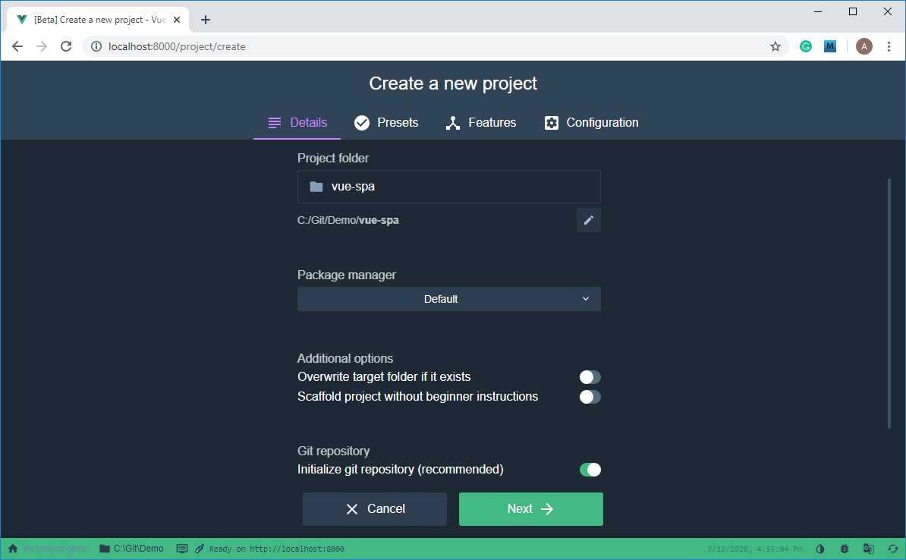
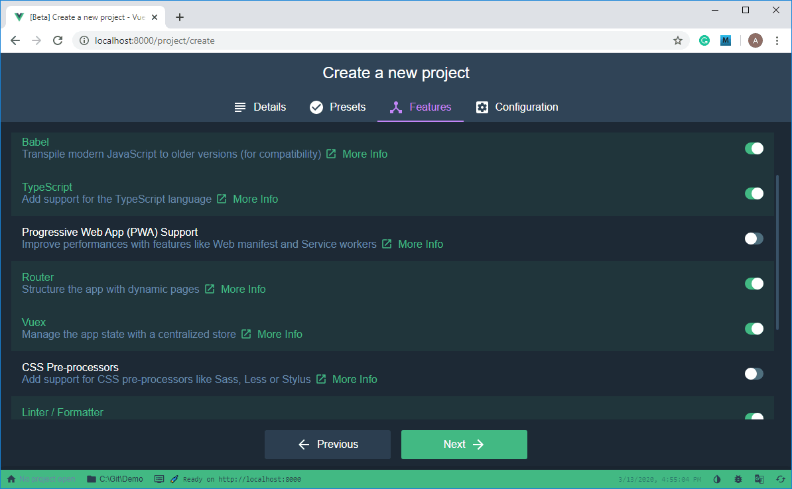
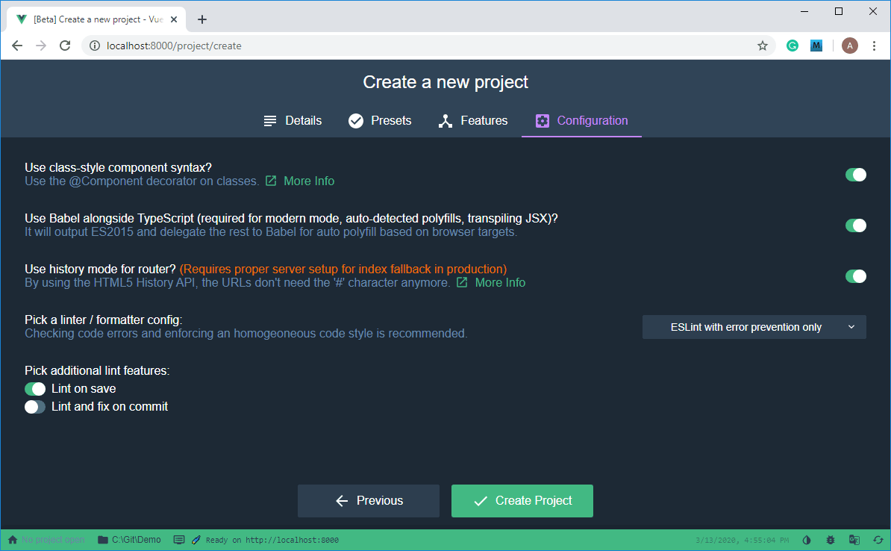
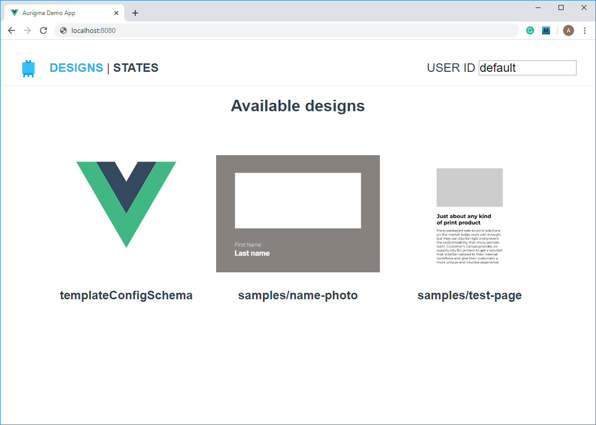
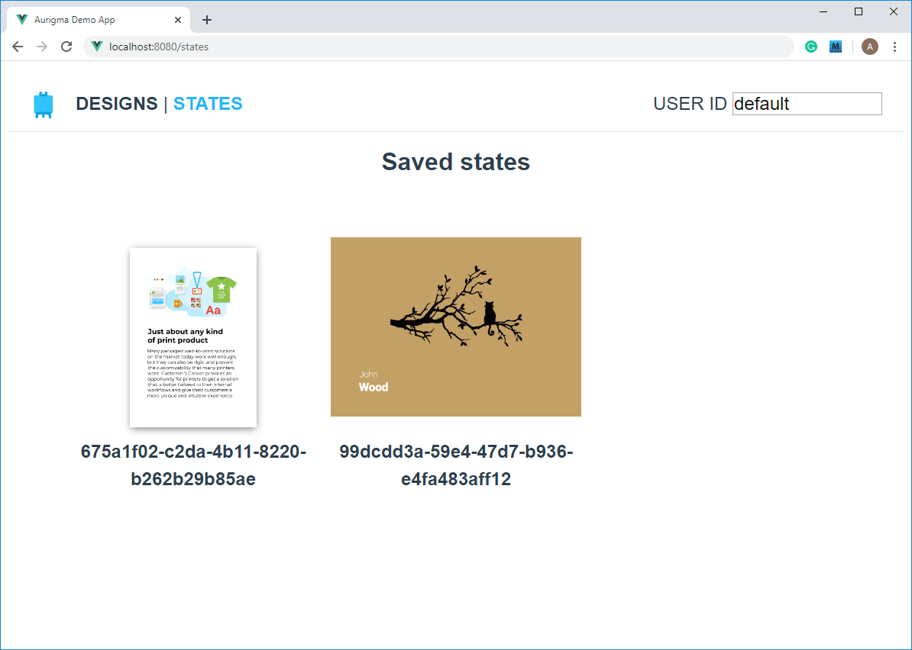
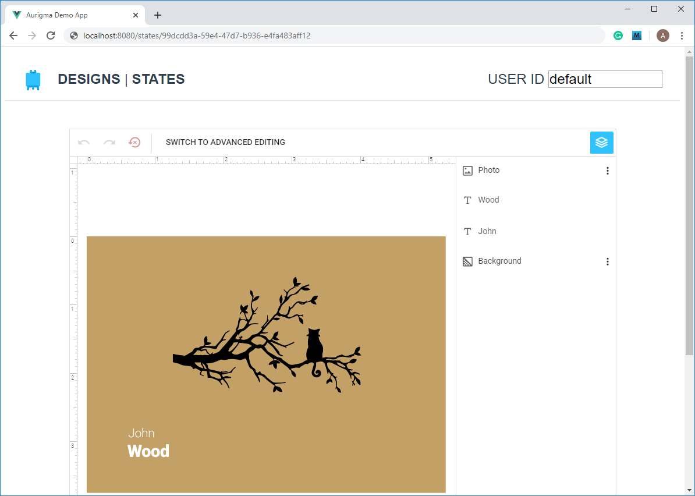
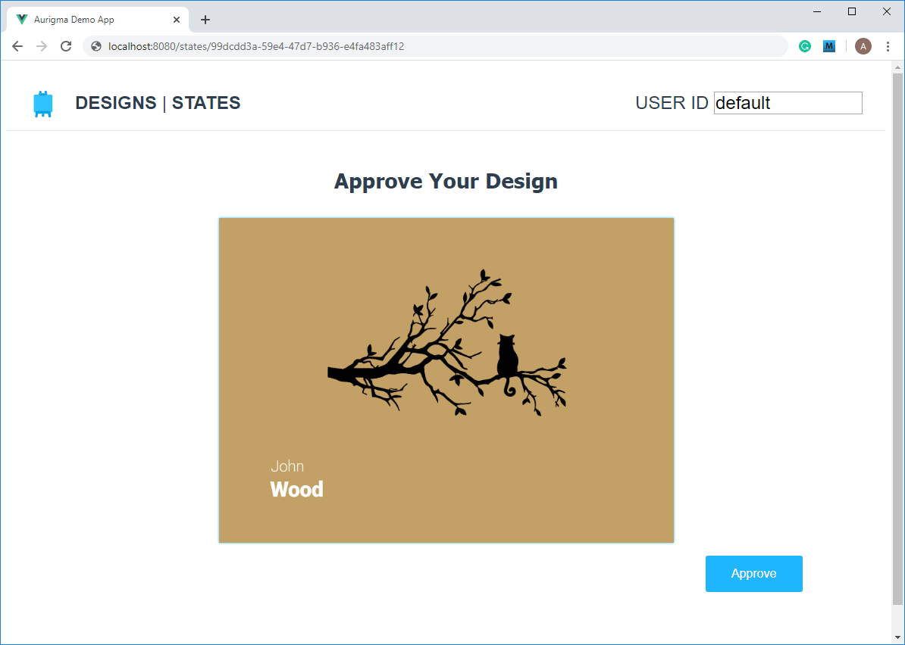
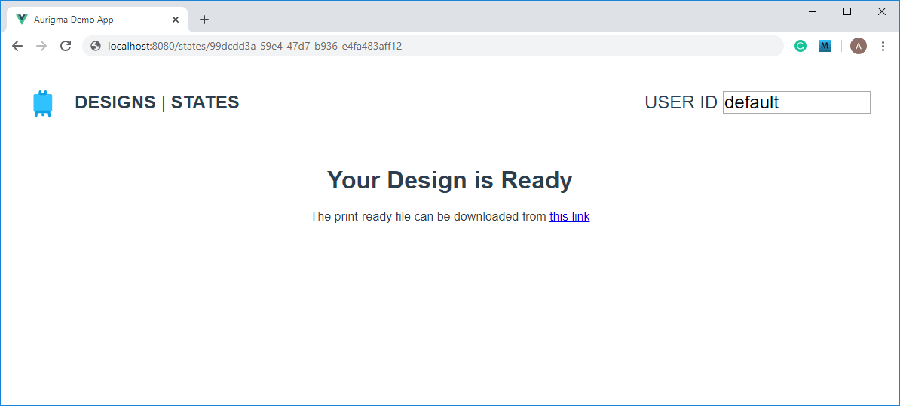

# An ASP.NET-based application that uses the Customer’s Canvas SDK

The Customer’s Canvas package contains a working sample of an ASP.NET-based application. You can run this application and just read this tutorial to learn how it works. As an alternative, you can follow these instructions to develop the same application from scratch.

This web application provides the basic functionality of Customer’s Canvas. What you will learn:

- How to obtain a list of uploaded design files.
- How to personalize designs by using the Customer’s Canvas SDK.
- How to save the personalized designs with the possibility to edit them later.

# Table of Contents

- [Applied Technologies](#applied-technologies)
- [Setting Up the Environment](#setting-up-the-environment) - [Customer’s Canvas](#customers-canvas) - [ASP.NET Core App](#aspnet-core-app) - [The Front End](#the-front-end) - [Installing Node.js](#installing-nodejs) - [Installing the JavaScript Tools](#installing-the-javascript-tools) - [Configuring Dependencies](#configuring-dependencies)
- [Development](#development) - [Developing the Back End](#developing-the-back-end) - [Developing the Front End](#developing-the-front-end)
- [Running the Application](#running-the-application)
- [The Resulting Application](#the-resulting-application)

# Applied Technologies

This web application will use:

- On the back end: ASP.NET Core 2.2 (you can use an LTS version, for example, 3.1).
- On the front end: Vue.JS with Vue CLI, Webpack, and Node Package Manager.
- The Customer’s Canvas SDK.

# Setting Up the Environment

## Customer’s Canvas

It is assumed that before you begin, you already have a deployed instance of the Customer’s Canvas application. You can find detailed information about installing and configuring Customer’s Canvas at
https://customerscanvas.com/docs/cc/

Configure the following settings in `Configuration/AppSettings.config`:

```XML
  <!-- Security -->
  <add key="SecureModeEnabled" value="True" />
  <add key="HttpHeaderAllowOriginDomains" value="*" />
  <add key="ApiSecurityKey" value="UniqueSecurityKey" />
  <add key="UnsafeHttpWebApiEnabled" value="true" />
```

You need to set `UnsafeHttpWebApiEnabled` to `true` when you run Customer’s Canvas and this application over different protocols, HTTP and HTTPS.

## ASP.NET Core App

For details about setting up the development environment and initializing the first ASP.NET Core project, you can refer to the Microsoft documentation at
https://docs.microsoft.com/en-us/aspnet/core/tutorials/first-mvc-app/start-mvc?view=aspnetcore-2.2&tabs=visual-studio-code

## The Front End

### Installing Node.js

For comfortable work with the Vue.js framework, you need to install the Node.js platform, which includes the npm package manager. You can download Node.js from the [official website](https://nodejs.org/en/).

### Installing the JavaScript Tools

When the installation of Node.js is complete, you can use **npm** to install the following tools that we will use for developing the front end:

1. [Vue.js](https://vuejs.org/v2/guide/) JavaScript framework

   `npm install -g vue`

2. [Vue CLI environment](https://cli.vuejs.org/guide/) for project management

   `npm install -g @vue/cli`

3. [Webpack](https://webpack.js.org/guides/installation/) representing a module bundler for JavaScript applications

   `npm install webpack`

### Configuring Dependencies

To configure dependencies of our project, you can use the Vue Project Manager, which provides a convenient graphical interface. To start working with this manager, at the command prompt, type:
`vue ui`

After executing this command, the Vue Project Manager automatically opens in your browser at http://localhost:8000, and you can start managing your project.

The user interface will appear as follows:


To create a new project, click **Create**. Then, specify a project directory and select **npm** as the **Package manager**. You can also create a git repository for your project.



After that, click **Next**, select the **Manual** preset, and click **Next** again to navigate to the **Features**. On this tab, enable **TypeScript**, **Router**, and **Vuex**. Verify that **Babel** and **Linter** are enabled by default.



Click **Next** again. On the **Configuration** tab, enable the **History mode for router** and configure **Lint**.



Click **Create Project** to confirm the settings, create the project, and install all the dependencies. After that, you can start development.

# Development

## Developing the Back End

The back end is responsible for interacting with the Customer’s Canvas Web API and implements the following functionality:

- Obtaining authorization tokens.
- Retrieving all designs uploaded to the Customer’s Canvas Design Editor.
- Retrieving saved Design Editor’s states for each user by their ID.

To implement these features, we will use the Customer’s Canvas Web API. Now, let’s see what basic data models this Web API provides.

```C#
    public class CustomersCanvasSettings
    {
        // CC Web API Url; e.g. https://example.com/cc/api
        public string Url { get; set; }

        // Unique security key. See more at https://customerscanvas.com/docs/cc/webapi.htm
        public string ApiKey { get; set; }
    }
    public class DesignDto
    {
        // Design (state) ID
        public string Id { get; set; }

        // Preview image link
        public string Preview { get; set; }
    }
    // See more at https://customerscanvas.com/docs/cc/web-api-for-manipulating-states.htm
    public class CanvasState
    {
        public string StateId { get; set; }

        public int SurfaceCount { get; set; }

        public string Tag { get; set; }
    }
    // See more at https://customerscanvas.com/docs/cc/authentication.htm
    public class CcAuthToken
    {
        public string TokenId { get; set; }

        public string UserId { get; set; }

        public DateTime ExpireTime { get; set; }

        public int OriginalSeconds { get; set; }

        public bool UpdateOnCall { get; set; }

        public string UserData { get; set; }
    }
```

After we have learned the data models of the Customer’s Canvas Web API, let’s create a class that processes these models.

```C#
public class CustomersCanvasApiClient
{
	// The RestSharp client.
	private IRestClient _client;
	// Settings of Customer’s Canvas.
	private readonly CustomersCanvasSettings _settings;

	// The constructor.
	public CustomersCanvasApiClient(CustomersCanvasSettings settings)
	{
		_settings = settings;
	}
}
```

Here, you need to implement all the necessary methods. You can find the complete code sample in the trial package of the Customer’s Canvas Design Editor. As an example, let’s see how you can implement getting a list of all designs uploaded to the Customer’s Canvas Design Editor.

```C#
public async Task<IEnumerable<DesignDto>> GetDesigns()
{
  var baseUrl = _settings.Url + "api/ProductTemplates/Designs/";

  _client = new RestClient(baseUrl + "?ext=true");
  _client.AddDefaultHeader("X-CustomersCanvasAPIKey", _settings.ApiKey);

  var request = new RestRequest(Method.GET);
  var response = await _client.ExecuteAsync<IEnumerable<CanvasDesignModel>>(request);

  return response.StatusCode != System.Net.HttpStatusCode.OK || response.ErrorException != null
    ? null
    : response.Data
        .Where(x => x.Ext.ToLower() == "psd")
        .Select(x => x.Id)
        .Select(x => new DesignDto()
        {
          Id = Path.IsPathRooted(x) ? Path.GetFileName(x) : x,
          Preview = baseUrl + x + "?width=400&height=400"
        });
    }
```

Next, add the following controllers to the project:

- `StatesController` to get a list of state files.
- `DesignsController` to get a list of designs.
- `TokensController` to generate authorization tokens.

Since we implemented the main functionality in the `CustomersCanvasApiClient` class, these controllers will contain a minimal amount of code. For example, `DesignsController` will look as follows:

```C#
    // Set a route path template.
    [Route("api/[controller]/[action]")]
    public class DesignsController : Controller
    {
        private readonly CustomersCanvasApiClient _apiClient;

        public DesignsController(IOptions<CustomersCanvasSettings> canvasOptions)
        {
            _apiClient = new CustomersCanvasApiClient(canvasOptions.Value);
        }

        [HttpGet]
        public async Task<IActionResult> GetAll()
        {
            var result = await _apiClient.GetDesigns();

            return result == null
                ? (IActionResult) new BadRequestObjectResult("An error occured, please try again later")
                : new JsonResult(result);
        }
    }
```

To provide the Customer's Canvas settings to the controllers, you need to edit `Startup.cs`.

```C#
	// This method is called at runtime to add services to the container.
	public void ConfigureServices(IServiceCollection services)
	{
		services.Configure<CustomersCanvasSettings>( Configuration.GetSection("CustomersCanvasApi"));
		// Allows cross-site requests (for SPA debugging).
		services.AddCors(options => options.AddPolicy("DebugPolicy",
			builder => builder.AllowAnyOrigin().
			AllowAnyMethod().
			AllowAnyHeader()));

		services.AddMvc().SetCompatibilityVersion(CompatibilityVersion.Version_2_2);
	}
	// This method is called at runtime to configure the HTTP request pipeline.
	public void Configure(IApplicationBuilder app, IHostingEnvironment env)
	{
		...
		app.UseCors("DebugPolicy");
		...
	}
```

You can define these settings in `appsettings.json` by adding the following object.

```JSON
    "CustomersCanvasApi": {
        "Url": "cc-example.com/",
        "ApiKey": "UniqueSecurityKey"
    }
```

## Developing the Front End

On the front end, interaction with Customer’s Canvas is implemented through the IFrame API module. This module will be available after deploying the Customer’s Canvas Design Editor. You can find more details about the IFrame API at:

https://customerscanvas.com/docs/cc/IframeApi-introduction.htm

Since we will use TypeScript to develop our application, we will need the `IframeApi.d.ts` file with type definitions. If this file is unavailable for some reason after deploying Customer’s Canvas, you can write its minimal version, relying on the data models described at:

https://customerscanvas.com/docs/cc/customerscanvas.iframeapi.objectmodel.htm

`IframeApi.ts`

```TypeScript
declare namespace CustomersCanvas {
    export namespace IframeApi {
        export namespace Editor {
            export namespace ObjectModel {
                export interface IProductDefinition {
                    name?: string;
                    surfaces: (string | ISurfaceFromState)[];
                    defaultSafetyLines?: ISafetyLine[];
                }
                export interface IBaseSurface {
                    name?: string;
                    foldingLines?: IFoldingLine[];
                    spines?: ISpine[];
                }
                export interface ISurfaceFromState extends IBaseSurface {
                    stateId: string;
                    surface?: number;
                }
                export interface IFoldingLine {
                    isVertical: boolean;
                    margin: Unit;
                    bleed: number;
                }
                export interface ISpine extends IFoldingLine {
                    width: number;
                    fillColor: string;
                }
                export interface ISafetyLine {
                    name?: string;
                    margin: number;
                    color?: string;
                    altColor?: string;
                    stepPx?: number;
                    widthPx?: number;
                }
            }
            export interface IProofResult {
                stateId: string;
                proofImageUrls: Array<string>;
            }
            export interface IFinishDesignResult {
                proofImageUrls: Array<string>;
                hiResOutputUrls: Array<string>;
                returnToEditUrl: string;
                stateId: string;
                userChanges: IUserChanges;
            }
            export interface IUserChanges {
                texts: {
                    name: string;
                    usersValue: string;
                }[];
                textPlaceholders: {
                    name: string;
                    usersValue: string;
                }[];
            }
            export interface IConfiguration {
                appUrl?: string;
                tokenId?: string;
                userId?: string;
            }
        }
        export function loadEditor(editorFrame: HTMLIFrameElement,
                     product: Editor.ObjectModel.IProductDefinition,
                     config?: Editor.IConfiguration,
                     onFirstLoad?: () => void): Promise<Editor>;
        export class Editor {
            constructor();
            public getProofImages(options?: {
                maxWidth?: number;
                maxHeight?: number;
            }): Promise<Editor.IProofResult>;
            public finishProductDesign(options?: {
                proofMaxWidth?: number;
                proofMaxHeight?: number;
            }): Promise<Editor.IFinishDesignResult>;
        }
        export class Unit {
        }
    }
}
```

Now that you have obtained the IframeApi model, let’s see how you can implement the Web API calls by accessing the back end of our application.

The BackendService class will be responsible for interaction with the back end. This class allows you to make requests to the back end and transfer the received data to Vue components. To perform this, you can use the fetch API or XMLHttpRequest. In `BackendService.ts`, let's how you can use the axios library to send requests to the server.

```TypeScript
import { DesignDto } from './models/DesignDto';
import axios from 'axios'

export class BackendService {

    private static _backendApiUrl: string = 'http://localhost:5000/';

    public static async getToken(userId: string): Promise<string> {
        let url = `${this._backendApiUrl}api/users/${userId}/tokens/generate`;
        let token = await this.loadData('', url);

        return token;
    }

    public static async loadDesigns(): Promise<DesignDto[]> {
        let url = `${this._backendApiUrl}api/designs/getall`;
        let designs = await this.loadData(new Array<DesignDto>(), url);

        return designs;
    }

    public static async loadStates(userId: string): Promise<string[]> {
        let url = `${this._backendApiUrl}api/users/${userId}/states/getall`;
        let states = await this.loadData(Array<string>(), url);

        return states;
    }

    private static async loadData<T>(defaultVaue: T, url: string): Promise<T> {
        let result: T = defaultVaue;
        try {
            let response = await axios.get(url);
            if (response.status == 200) {
                result = response.data;
            } else {
                console.error(response.data);
            }
        } catch (error) {
            console.error(error);
        } finally {
            return result;
        }
    }
}
```

Here, we import the `models/DesignDto.cs` file that describes the design model from the server:

```C#
export class DesignDto {
    constructor(public id: string = '', public preview: string = '') {
    }
}
```

Now, let's see how you can work with the IFrameAPI. To separate the presentation from the logic, we put this functionality in a single class `IframeApiService`.

```TypeScript
import "./iframeApi/IframeApi.ts";
export class IFrameApiService {
    public static async loadEditor(iframe: HTMLIFrameElement, file: string, mode: string, userId: string,
	                               token?: string): Promise<CustomersCanvas.IframeApi.Editor> {
        if (mode == "designs") {
            return await this.loadEditorForDesign(iframe, file, userId, token);
        } else {
            return await this.loadEditorForState(iframe, file, userId, token);
        }
    }
    ...
}
```

Here, the `loadEditor` method calls either `loadEditorForDesign` or `loadEditorForState` to initialize the editor by using the IFrameAPI. If the `mode` parameter is `'designs'`, then a design template will be loaded into the editor. Otherwise, a state file will be loaded into the editor. The state files represent saved states of the Customer's Canvas Design Editor and allow you to return to editing the previously saved designs.

```TypeScript
    private static async loadEditorForState(iframe: HTMLIFrameElement, state: string, userId: string,
	                                        token?: string) : Promise<CustomersCanvas.IframeApi.Editor> {
        let productDefinition: CustomersCanvas.IframeApi.Editor.ObjectModel.IProductDefinition = {
            surfaces: [{ stateId: state }]
        };
        let config = {
            tokenId: token,
            userId: userId
        };
        let editor = await CustomersCanvas.IframeApi.loadEditor(iframe, productDefinition, config);
        return editor;
    }
```

Now, let's go further to the user interface. First, we delete the files created by vue-cli when generating the project - `components/HelloWorld.vue` and `view/About.vue`.

Our application will contain three views: a list of available design files, a page for editing the design and saving a personalized state, and a list of states saved by the user. In the views folder, we will create two empty files for the new views, `Editor.vue` and `States.vue`. To display the list of design files, we will use the main page `Home.vue`.

Now that the views have been created, you can configure the state storage of the Vuex application and routing paths in vue-router. By default, vue-router appends the `#` sign to the page URL. To avoid this, we enabled the history mode. To configure routing, we import the components and map them to the URLs of pages that will be displayed according to the request. In the URLs, dynamic parameters begin with a colon (for example, id). The last route redirects to the main page when an undefined URL is received.

```TypeScript
import Vue from 'vue'
import VueRouter from 'vue-router'
import Home from '../views/Home.vue'
import States from '../views/States.vue'
import Editor from '../views/Editor.vue'

Vue.use(VueRouter)
const routes = [
  {
    path: '/',
    name: 'home',
    component: Home
  },
  {
    path: '/states',
    name: 'states',
    component: States
  },
  {
    path: '/designs/:id',
    name: 'editor',
    component: Editor
  },
  {
    path: '/states/:id',
    name: 'editor',
    component: Editor
  },
  {
    path: '*',
    redirect: '/'
  }
]

const router = new VueRouter({
  mode: 'history',
  routes
})
export default router
```

For details about the Vuex model, you can refer to the documentation at https://vuex.vuejs.org/. Now, you must ensure that data stored in a state cannot be changed directly. To access the data, you need to use **mutations** that are produced through **actions**.

```TypeScript
import Vue from "vue";
import Vuex from "vuex";
import { BackendService } from "@/code/BackendService";

Vue.use(Vuex);

const defaultUserId = "userId";

export default new Vuex.Store({
  state: {
    designs: [],
    states: [],
    userId: defaultUserId,
    userToken: ""
  },
  mutations: {
    SET_TOKEN(state, data) {
      state.userToken = data;
    },
    SET_DESIGNS(state, data) {
      state.designs = data;
    },
    SET_STATES(state, data) {
      state.states = data;
    },
    SET_USERID(state, data) {
      state.userId = data;
    }
  },
  actions: {
    SET_TOKEN: async (context) => {
      let userId = context.state.userId;
      let userToken = await BackendService.getToken(userId);
      context.commit("SET_TOKEN", userToken);
    },
    SET_DESIGNS: async (context) => {
      let designs = await BackendService.loadDesigns();
      context.commit("SET_DESIGNS", designs);
    },
    SET_STATES: async (context) => {
      let userId = context.state.userId;
      let states = await BackendService.loadStates(userId);
      context.commit("SET_STATES", states);
    },
    SET_USERID: (context, userId) => {
      if (userId == "" || userId == undefined) {
        userId = defaultUserId;
      }
      context.commit("SET_USERID", userId);
    }
  },
  modules: {
  }
})
```

We store a list of design files, a list of user states, a user ID, and a user’s authentication token as the application's properties. In the previous example, we defined mutations to change the values of these properties and actions that cause the mutations.

After configuring the data and routes, you can return to the views. Now, you need to define templates for HTML pages. First, we create two components in the corresponding folder: the `components/HomePage.vue` and `components/Gallery.vue` files. The `HomePage.vue` component will accept a string message from the parent view and will display it to the user.

```HTML
<template>
  <div class="home">
    <h1>{{ msg }}</h1>
  </div>
</template>

<script lang="ts">
import Vue from 'vue';

export default Vue.extend({
  name: 'HomePage',
  props: {
    msg: String,
  },
});
</script>

<!-- Add "scoped" attribute to limit CSS to this component only -->
<style scoped>
li {
  display: inline-block;
  margin: 0 10px;
}
</style>
```

`Gallery.vue` is a more complex component. We will use it to display a grid of elements. Every cell of this grid contains a preview image for a design or a state, a link to return to editing the design, and a text box displaying the design ID. When the parent component passes parameters into `Gallery.vue`, they will contain a string defining the editor's loading mode, either `'designs'` or `'states'`, and an array called `DesignDto` that defines the content of this component. If the preview image fails to load, the Vue logo is displayed instead.

```HTML
<template>
  <div class="gallery">
    <div class="gallery-panel"
         v-for="item in items"
         :key="item.id">
      <router-link :to="`/${mode}/${ encodeURIComponent(item.id)}`">
        
      </router-link>
      <span>{{item.id}}</span>
    </div>
  </div>
</template>

<script lang="ts">
import Vue from 'vue';
import { DesignDto } from '../code/models/DesignDto';
export default Vue.extend({
  name: 'Gallery',
  props: {
      items: {
          type: Array as () => Array<DesignDto>
      },
      mode: {
        type: String
      }
  },
  methods :{
    handleImageLoadingError(event: Event) {
      let target = event.target as HTMLImageElement;
      let source = document.getElementById('vue-logo') as HTMLImageElement;
      target.src = source.src;
    }
  }
});
</script>
```

Now that we have defined the components, we can proceed to define the view templates. Since `Home.vue` and `States.vue` only differ in parameter names and messages displayed to the user, we will just look at Home.vue here. By using mutations, we will get a user token and a list of design files. By using the computed properties, we will set a message for the **HomePage** component and a list of design files for the **Gallery**.

```HTML
<template>
  <div class="home">
    <HomePage :msg="message"/>
    <gallery :items="states" mode="states"></gallery>
  </div>
</template>
<script lang="ts">
import Vue from 'vue';
import HomePage from '@/components/HomePage.vue'
import Gallery from '@/components/Gallery.vue'
export default Vue.extend({
  name: 'states',
  components: {
    HomePage,
    Gallery
  },
  computed: {
    states(): [] {
      return this.$store.state.states;
    },
    hasStates(): Boolean {
      return this.$store.state.states.length > 0;
    },
    message(): String {
      if (this.hasStates) {
        return "Saved states";
      } else {
        return "There are no saved states yet";
      }
    }
  },
  mounted() {
    this.$store.dispatch('SET_TOKEN');
    this.$store.dispatch('SET_STATES');
  }
});
</script>
```

Now, let’s see a fragment of `Editor.vue`. Since you can find the complete source code in the distribution package, we have omitted the layout details and describe only the logic.

```TypeScript
<script lang="ts">
import Vue from 'vue';
import { IFrameApiService } from '../code/IFrameApiService'
    export default Vue.extend({
        name: 'editor',
        computed: {
        },
        methods: {
            async loadEditor() {
                this.$data.stage = "edit";
                let editor = await IFrameApiService.loadEditor(this.iframe, this.design, this.mode, this.userId, this.token);
                this.$data.editorLoaded = true;
                (window as any)['editor'] = editor;
            },
            async getPreview() {
                this.$data.proofImages = await IFrameApiService.getPreviewImages(this.editor, 800, 800);
                this.$data.stage = "preview";
            },
            async saveProduct() {
                this.$data.hiRes = this.mode == 'states'
                    ? await IFrameApiService.finishDesign(this.editor, 800, 800, this.design)
                    : this.$data.hiRes = await IFrameApiService.finishDesign(this.editor, 800, 800);
                this.$data.stage = "finish";
            }
        },
        data() {
            return {
                stage: String,
                editorLoaded: Boolean,
                proofImages: {
                    type: Array as () => Array<string>
                },
                hiRes: {
                    type: Array as () => Array<string>
                }
            }
        },
        created() {
            this.$data.proofImages = [];
            this.$data.hiRes = [];
            this.$data.editorLoaded = false;
        },
        async mounted() {
            await this.loadEditor();
        }
    });
</script>
```

This view stores the following as `data`: this view stores a string indicating the current status of the editor (**stage**, which is used for conditional rendering of components), the loading state of the editor (**editorLoaded**, which is used for conditional rendering of components), an array of links to preview images of the personalized design (**proofImages**), and an array of links to print-ready files (**hiRes**). When creating a view, the data is initialized first, and then the editor starts to load. The following code fragment illustrates the computed properties.

```TypeScript
	computed: {
		design(): string {
			return decodeURIComponent(this.$route.params.id);
		},
		token(): string {
			return this.$store.state.userToken;
		},
		userId(): string {
			return this.$store.state.userId;
		},
		iframe(): HTMLIFrameElement {
			return document.getElementById("editor-frame") as HTMLIFrameElement;
		},
		mode(): string {
			return this.$route.path.split('/')[1];
		},
		editor(): CustomersCanvas.IframeApi.Editor {
			return (window as any)['editor'];
		},
		currentStage(): string {
			return this.$data.stage;
		},
		hiResLink(): string {
			if (this.$data.hiRes != undefined && this.$data.hiRes.length > 0) {
				return this.$data.hiRes[0];
			} else {
				return '';
			}
		},
		previewImg (): string {
			if (this.$data.proofImages != undefined && this.$data.proofImages.length > 0) {
				return this.$data.proofImages[0];
			} else {
				return '';
			}
		}
	}
```

To finish developing the application, you only need to modify the main component, `App.vue` (CSS-styles are omitted). When the application is first loaded, mutations are called to set up the user ID and the authentication token for this identifier. When you change the user ID in the input field, these mutations are also called. In the keep-alive tag, we specify that the list of designs should not be updated every time you return to the main page.

```HTML
<template>
  <div id="app">
    <div id="nav">
      <div class="nav-wrapper">
        
        
        <router-link to="/">DESIGNS </router-link> |
        <router-link to="/states">STATES</router-link>
      </div>
      <div class="user-id-wrapper">
        <label>USER ID </label><input type="text" v-model="userId" class="user-id-input"><br>
      </div>
    </div>
    <keep-alive include="home">
      <router-view/>
    </keep-alive>
  </div>
</template>

<script>
import Vue from 'vue';
export default {
  computed: {
    userId: {
      get() {
        return this.$store.state.userId;
      },
      set(value) {
        this.$store.dispatch('SET_USERID', value);
        this.$store.dispatch('SET_TOKEN');
      }
    },
  },
  mounted() {
    this.$store.dispatch('SET_USERID');
    this.$store.dispatch('SET_TOKEN');
  }
}
</script>
```

After this, you can run the developed application.

# Running the Application

To run the back end, at the command prompt:

1. Navigate to the project folder:

   `cd dotnet\AurigmaDemoApp`

2. Run the server:

   `dotnet run`

To run the front end, at the command prompt:

1. Navigate to the project folder:

   `cd vue-spa`

2. Set up the project:

   `npm install`

3. Compile and run the client:

   `npm run serve`

Now, you can open this application in your browser and see the results. In the address bar, type:
http://localhost:8080

# The Resulting Application

The start page with a gallery of design templates:


The page with a gallery of saved states:


The Editor page:


The preview of the personalized design:


The link to print-ready files:

