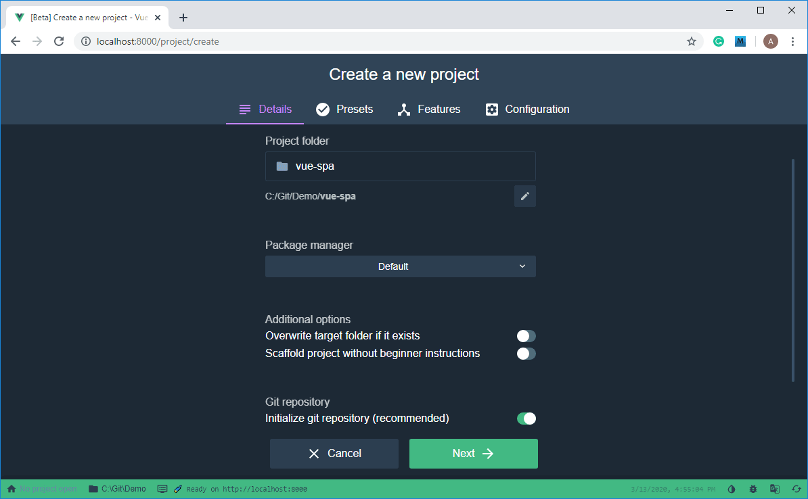

An ASP.NET-based demo that uses the Customer’s Canvas UI Framework
=====

The Customer’s Canvas package contains a working sample of an ASP.NET Core application. You can simply run this application and read this tutorial to learn how it works. As an alternative, you can follow these instructions to develop the same application from scratch. 

This web application demonstrates the basic functionality of Customer’s Canvas. You will learn how to:
- Generate authorization tokens.
- Obtain a list of uploaded design files.
- Personalize designs by using the Customer’s Canvas SDK.
- Save the personalized designs with the possibility to edit them later.

# Table of Contents

- [Applied Technologies](#applied-technologies)
- [Setting Up the Environment](#setting-up-the-environment)
	- [Customer’s Canvas](#customers-canvas)
	- [ASP.NET Core App](#aspnet-core-app)
	- [The Front End](#the-front-end)
		- [Installing Node.js](#installing-nodejs)
		- [Installing the JavaScript Tools](#installing-the-javascript-tools)
		- [Configuring Dependencies](#configuring-dependencies)
- [Development](#development)
	- [Developing the Back End](#developing-the-back-end)
	- [Developing the Front End](#developing-the-front-end)
	- [Creating Configs](#creating-configs)
- [Running the Application](#running-the-application)
- [The Resulting Application](#the-resulting-application)

# Applied Technologies

This web application will use:
- On the back end: ASP.NET Core (3.1 LTS).
- On the front end: Vue.JS with Vue CLI, Webpack, and Node Package Manager.
- The Customer’s Canvas SDK ([Design Editor](https://customerscanvas.com/docs/cc/) and [UI Framework](https://customerscanvas.com/support/ui-framework)).


# Setting Up the Environment
## Customer’s Canvas

It is assumed that before you begin, you already have a deployed instance of the Customer’s Canvas application. You can find detailed information about installing and configuring Customer’s Canvas at
https://customerscanvas.com/docs/cc/


## ASP.NET Core App

For details about setting up the development environment and initializing the first ASP.NET Core project, you can refer to the Microsoft documentation at 
https://docs.microsoft.com/en-us/aspnet/core/tutorials/first-mvc-app/start-mvc?view=aspnetcore-3.1&tabs=visual-studio-code


## The Front End
### Installing Node.js

For comfortable work with the Vue.js framework, you need to install the Node.js platform, which includes the npm package manager. You can download Node.js from the [official website](https://nodejs.org/en/).

### Installing the JavaScript Tools

When the installation of Node.js is complete, you can use **npm** to install the following tools that we will use for developing the front end:
1. [Vue.js](https://vuejs.org/v2/guide/) JavaScript framework

	`npm install -g vue`
2. [Vue CLI environment](https://cli.vuejs.org/guide/) for project management

    `npm install -g @vue/cli`
3. [Webpack](https://webpack.js.org/guides/installation/) representing a module bundler for JavaScript applications

    `npm install webpack`
4. [Axios](https://github.com/axios/axios) promise-based HTTP client for the browser

    `npm install axios`

### Configuring Dependencies

To configure dependencies of our project, you can use the Vue Project Manager, which provides a convenient graphical interface. To start working with this manager, at the command prompt, type:
    `vue ui`

After executing this command, the Vue Project Manager automatically opens in your browser at http://localhost:8000, and you can start managing your project. 

The user interface will appear as follows:


To create a new project, click **Create**. Then, specify a project folder and select **npm** as the **Package manager**. You can also create a git repository for your project.



After that, click **Next**, select the **Manual** preset, and click **Next** again to navigate to the **Features**. On this tab, enable **TypeScript**, **Router**, and **Vuex**. Verify that **Babel** and **Linter** are enabled by default.


Click **Next** again. On the **Configuration** tab, enable the **History mode for router** and configure **Lint**.


Click **Create Project** to confirm the settings, create the project, and install all the dependencies. After that, you can start development.

# Development
## Developing the Back End

The back end is responsible for interacting with the Customer’s Canvas Web API and implements the following functionality:
- Obtaining [authorization tokens](#authorization-tokens).
- Retrieving the list of available [UI Framework configs](#ui-framework-configs).
- Saving UI Framework projects.
- Retrieving saved configs for each user by their ID.

### Authorization Tokens

The Customer’s Canvas Design Editor requires an authorization token for a single user to access the user's private data, for example, their uploads. To generate such a token, you can use the Customer’s Canvas Web API. First, let’s look at some basic data models for this Web API.

```C#
// Web API settings. See more at https://customerscanvas.com/docs/cc/webapi.htm
public class CustomersCanvasSettings
{
    // CC Web API Url; e.g. https://example.com/cc/
    public string Url { get; set; }

    // Unique security key.
    public string ApiKey { get; set; }
}

// Authorization tokens. See more at https://customerscanvas.com/docs/cc/authentication.htm
public class CcAuthToken
{
    public string TokenId { get; set; }
    public string UserId { get; set; }
    public DateTime ExpireTime { get; set; }
    public int OriginalSeconds { get; set; }
    public bool UpdateOnCall { get; set; }
    public string UserData { get; set; }
}
```

Now, let’s create a class that uses the Customer’s Canvas Web API.

```C#
public class CustomersCanvasApiClient
{
	// The RestSharp client.
	private IRestClient _client;
	// Settings of Customer’s Canvas.
	private readonly CustomersCanvasSettings _settings;

	// The constructor.
	public CustomersCanvasApiClient(CustomersCanvasSettings settings)
	{
		_settings = settings;
	}
}
```

Here, you need to implement all the necessary methods. For example, you can generate authorization tokens as follows:

```C#
public async Task<string> GenerateToken(string userId)
{
    int tokenLifeTime = 3600;
    string updateOnCall = "True";
    var baseUrl = _settings.Url + $"api/auth/users/{userId}/tokens?seconds={tokenLifeTime}&updateOnCall={updateOnCall}";
    _client = new RestClient(baseUrl);
    _client.AddDefaultHeader("X-CustomersCanvasAPIKey", _settings.ApiKey);
    var request = new RestRequest(Method.POST);
    var response = await _client.ExecuteAsync<CcAuthToken>(request);

    if (response.StatusCode != System.Net.HttpStatusCode.OK ||    re-sponse.ErrorException != null)
    {
        return null;
    }
    else
    {
        return response.Data.TokenId;
    }
}
```

You can find the complete code sample in the trial package of the Customer’s Canvas Design Editor.

Next, let's see how you can integrate the Aurigma UI Framework.

### UI Framework Configs

The UI Framework represents a multi-step product editor. One of its steps is the Customer's Canvas Design Editor, which stores all design elements and configurations in a *state file*. Unlike the Design Editor, the UI Framework stores the editor's state as a special string, a so-called *snapshot*, containing encrypted information about the state of all widgets specified in a config.

You can define a model describing a UI Framework *project* as follows:

```C#
public class Project
{
    public long Id { get; set; }
    public string ConfigId { get; set; }
    public string Snapshot { get; set; }
    public string Preview { get; set; }
    [Required]
    public string UserId { get; set; }
}
```

We will store information about such projects in an SQLite database and work with the database by using the Entity Framework Core. For more details about working with the Entity Framework Core and SQLite, refer to https://docs.microsoft.com/en-us/ef/core/get-started/?tabs=netcore-cli. 

We will create our database by using the Code First approach. To start working with the database, we need to create a class defining the data context, which is inherited from Microsoft.EntityFrameworkCore.DbContext.

```C#
public class AppDbContext : DbContext
{
    public DbSet<Project> Projects { get; set; }

    protected override void OnConfiguring(DbContextOptionsBuilder optionsBuilder)
    {
        optionsBuilder.UseSqlite("Data Source=App_Data\\projects.db");
    }
}
```

Then, implement operations on projects in a single class.

```C#
public static class ProjectsRepository
{
    public static async Task<Project> Update(Project project)
    {
        ...
    }
    public static async Task<Project> Save(Project project)
    {
        ...
    }
    public static async Task<Project> Get(string userId, long id)
    {
        ...
    }
    public static async Task<List<Project>> GetAllForUser(string userId)
    {
        ...
    }
}
```

We also need to manage the editor's configs. A *config* is a file in the JSON format that describes the editor settings and widgets used. For more details about widgets, refer to https://customerscanvas.com/support/ui-framework/widgets/readme.md. Let's store configs in the application's working folder. In this case, you can get the list of configs and a single config as follows:

```C#
public static class ProductsHelper
{
    private static string ConfigsDirectory = @"App_Data\products";
    public static IEnumerable<string> GetProductConfigsList()
    {
        var files = Directory.EnumerateFiles(ConfigsDirectory, "*.json")
            .Select(x => x.Replace(ConfigsDirectory + "\\", "").Replace(".json", ""));
        return files;
    }

    public static async Task<string> GetProductConfig(string filename)
    {
        var path = Path.Combine(ConfigsDirectory, filename + ".json");
        if (File.Exists(path))
        {
            return await File.ReadAllTextAsync(path);
        }
        else
        {
            return "";
        }
    }
}
```

Next, add the following controllers to the project:
- `TokensController` to generate authorization tokens.
- `ProjectsController` to save and load projects.
- `ProductsController` to get configs.

Since we implemented the main functionality in the `CustomersCanvasApiClient`, `ProductsHelper`, and `ProjectsRepository` classes, these controllers will contain a minimum amount of code. For example, `ProjectsController` will look as follows:

```C#
[ApiController]
public class ProjectsController : ControllerBase
{
    [HttpPost]
    [Route("api/[controller]/[action]")]
    public async Task<IActionResult> Create([FromBody] Project project)
    {
        var result = await ProjectsRepository.Save(project);
        return new JsonResult(result);
    }

    [HttpPut]
    [Route("api/[controller]/[action]")]
    public async Task<IActionResult> Update([FromBody] Project project)
    {
        var result = await ProjectsRepository.Update(project);
        return new JsonResult(result);
    }

    [HttpGet]
    [Route("api/users/{userId}/[controller]/[action]")]
    public async Task<IActionResult> GetAll(string userId)
    {
        var result = await ProjectsRepository.GetAllForUser(userId);
        return new JsonResult(result);
    }

    [HttpGet]
    [Route("api/users/{userId}/[controller]/{projectId}")]
    public async Task<IActionResult> Get(string userId, long projectId)
    {
        var result = await ProjectsRepository.Get(userId, projectId);
        if (result == null)
        {
            return StatusCode(404);
        }
        else
        {
            return new JsonResult(result);
        }
    }
}
```

To provide the Customer's Canvas settings to the controllers, you need to edit `Startup.cs`. Also we will use static files (we will store some js modules on backend).

```C#
	// This method is called at runtime to add services to the container.
	public void ConfigureServices(IServiceCollection services)
	{
		services.Configure<CustomersCanvasSettings>( Configuration.GetSection("CustomersCanvasApi"));
		// Allows cross-site requests (for SPA debugging).
		services.AddCors(options => options.AddPolicy("DebugPolicy",
			builder => builder.AllowAnyOrigin().
			AllowAnyMethod().
			AllowAnyHeader()));
      // Enables Entity Framework Core.
      services.AddEntityFrameworkSqlite().AddDbContext<AppDbContext>();
      services.AddMvc(options => options.EnableEndpointRouting = false)      .AddNewtonsoftJson()
          .SetCompatibilityVersion(CompatibilityVersion.Version_3_0);        
	}
	// This method is called at runtime to configure the HTTP request pipeline.
	public void Configure(IApplicationBuilder app, IHostingEnvironment env)
	{
		...
		app.UseStaticFiles();
		app.UseCors("DebugPolicy");
		...
	}
```

To rewrite `wwwroot` path let's change `Program.cs`. We will store our js modules in `App_Data\static\modules`, so we need to rewrite this path.

```C#
    public class Program
    {
        public static void Main(string[] args)
        {
            CreateWebHostBuilder(args).Build().Run();
        }

        public static IWebHostBuilder CreateWebHostBuilder(string[] args) =>
            WebHost.CreateDefaultBuilder(args)
                .UseStartup<Startup>()
                .UseWebRoot(@"App_Data\static");
    }
```

To read Customer’s Canvas settings from configs, add the following object to `appsettings.json`.

```JSON
    "CustomersCanvasApi": {
        "Url": "https://cc-example.com/version/",
        "ApiKey": "UNIQUE_API_KEY"
    }
```

## Developing the Front End

On the front end, interaction with Customer’s Canvas is implemented through the UI Framework. To enable the UI Framework on your server, you can either install it locally or use it from a Content Delivery Network. In this demo, we use jsDelivr CDN through URL `https://cdn.jsdelivr.net/npm/@aurigma/ui-framework@VERSION_NUMBER/dist/`, where VERSION_NUMBER is the UI Framework version. You can find more details about the UI Framework installation at 
https://customerscanvas.com/docs/cc/getting-started-with-uif.htm

**We strongly recommend you to use UI-Framework v 4.8.0 with this demo applications.**

In this demo, the `BackendService` class will be responsible for interaction with the back end. This class allows you to make requests to the back end and transfer the received data to Vue components. To perform this, you can use the fetch API or XMLHttpRequest. As an alternative, in `BackendService.ts` you can learn how to use the axios library to send requests to the server. 

```TypeScript
import axios from 'axios';
import { ProjectDto } from './models/ProjectDto';
import { ProductDto } from './models/ProductDto';

export class BackendService {
    private static _backendApiUrl: string = 'https://localhost:5001';
    public static async loadProducts(): Promise<ProductDto[]> {
        let products = new Array<ProductDto>();
        let url = `${this._backendApiUrl}/api/products/getall`;
        let response = await this.loadData(new Array<string>(), url);
        response.forEach(x => {
            products.push(new ProductDto(x));
        })
        return products;
    }

     public static async loadProductConfig(id: string): Promise<Object> {
        let url = `${this._backendApiUrl}/api/products/${id}`;
        let response = await this.loadData({}, url);
        return response;
    }

    public static async loadProjects(userId: string): Promise<ProjectDto[]> {
        let url = `${this._backendApiUrl}/api/users/${userId}/projects/getall`;
        let projects = await this.loadData(new Array<ProjectDto>(), url);
        return projects;
    }

    public static async saveProject(dto: ProjectDto): Promise<void> {
        let url = `${this._backendApiUrl}/api/projects/create`;
        await this.sendData(dto, url);
    }

    public static async updateProject(dto: ProjectDto): Promise<void> {
        let url = `${this._backendApiUrl}/api/projects/update`;
        await this.updateData(dto, url);
    }

    public static async getToken(userId: string): Promise<string> {
        let url = `${this._backendApiUrl}/api/users/${userId}/tokens/generate`;
        let token = await this.loadData('', url);
        return token;
    }
}
```

Here, we include `models/ProductDto` and `models/ProjectDto` files that contain models of products and projects received from the back end.

_**NOTE!** In terms of the UI Framework, a `product` is an object representing an item in an e-commerce system. In this demo, we refer to the configs of the editor as `products`._

In the `UiFrameworkInitializer` class, we initialize the multi-step editor:
1. Connect to `moduleLoader`.
2. Get configurations from the back end.
3. Initialize an [e-commerce driver](https://customerscanvas.com/support/ui-framework/using-default-driver.md)

```TypeScript
import { BackendService } from './BackendService';

export class UiFrameworkInitializer {
    // Load the UI Framework from jsDelivr CDN.  
    public readonly _uiFrameworkBaseUrl = "https://localhost:5001/ui-framework/4.8.0/";
    private _ccBaseUrl = "YOUR_CUSTOMERSCANVAS_INSTANCE_URL";
    private readonly _driverUrl = this._uiFrameworkBaseUrl + "drivers/default-driver.js";
    private readonly _editorUrl = this._uiFrameworkBaseUrl + "editor.js";

    ...
    // Instantiate a loader of UI Framework modules.
    constructor(moduleLoader:any) {
        this._moduleLoader = moduleLoader;
        // The URL of your CustomersCanvas instance.
        this._settings = {
            customersCanvasBaseUrl: this._ccBaseUrl
        };
        // Define an e-commerce product to initialize the editor.
        this._product = {
            id: 0,
            sku: "PRODUCT-001",
            name: "My Product",
            description: "This is a test product.",
            options: [],
            price: 1,
            attributes: []
        };
    }
    // Load UI Framework modules.
    public async init() {
        let driverModule = await this._moduleLoader.dynamicImport("ecommerceDriver", this._driverUrl);
        this._driver = driverModule.ecommerceDriver;
        let editorModule = await this._moduleLoader.dynamicImportDefault("editor", this._editorUrl);
        this._editor = editorModule.editor;
    }
    // Load the multi-step editor.
    public async loadEditor(parentDivId: string, configId: string, productQuantity: Number, existingProduct: Object | null, userInfo: UserInfo): Promise<any> {
        let config = await BackendService.loadProductConfig(configId);
        let ecommerce = await this._driver.init(this._product, this._editor, config, this._settings, existingProduct, productQuantity, userInfo);
        ecommerce.products.current.renderEditor(document.getElementById(parentDivId));
        return ecommerce;
    }
}
```

To load the editor, you need configs. You can find a detailed description of widgets and their configurations at https://customerscanvas.com/support/ui-framework/widgets/readme.md. Later in this tutorial, we will give an example of a [simple config](#creating-configs). You can also refer to configs in the demo project.


Now, let's move further into the user interface. First, we delete the files created by vue-cli when generating the project - `components/HelloWorld.vue` and `view/About.vue`.

Our application will contain three views: a list of available products (configs), a page for editing designs and saving a personalized state, and a list of projects saved by the user. In the `views` folder, we will create two empty files for the new views `Editor.vue` and `Projects.vue`. To display the list of products, we will use the main page `Home.vue`.

Now that the views have been created, you can configure the state storage of the Vuex application and routing paths in vue-router. By default, vue-router appends the `#` sign to the page URL. To avoid this, we enabled the history mode. To configure routing, we import the components and map them to the URLs of pages that will be displayed according to the request. In the URLs, dynamic parameters begin with a colon (for example, id).

```TypeScript
import Vue from 'vue'
import VueRouter from 'vue-router'
import Home from '../views/Home.vue'
import Editor from '../views/Editor.vue'
import Projects from '../views/Projects.vue'

Vue.use(VueRouter)
const routes = [
  {
    path: '/',
    name: 'home',
    component: Home
  },
  {
    path: '/projects',
    name: 'projects',
    component: Projects
  },
  {
    path: '/projects/:id',
    name: 'ui-framework-editor',
    component: Editor
  },
  {
    path: '/products/:id',
    name: 'ui-framework-editor',
    component: Editor
  }
]
```

For details about the Vuex model, you can refer to the documentation at https://vuex.vuejs.org/. Now, you should note that data stored in a state cannot be changed directly. To access the data, you need to use **mutations** that are produced through **actions**.

```TypeScript
import Vue from 'vue'
import Vuex from 'vuex'
import { BackendService } from '@/code/BackendService';

Vue.use(Vuex)

export default new Vuex.Store({
  state: {
    products: [],
    projects: [],
    userId: 'default',
    userToken: ''
  },
  mutations: {
    SET_TOKEN(state, data) {
      state.userToken = data;
    },
    SET_USERID(state, data) {
      state.userId = data;
    },
    SET_PRODUCTS(state, data) {
      state.products = data;
    },
    SET_PROJECTS(state, data) {
      state.projects = data;
    }
  },
  actions: {
    SET_TOKEN: async(context) => {
      if (context.state.userToken == '' || context.state.userToken == undefined) {
        let userId = context.state.userId;
        let userToken = await BackendService.getToken(userId);
        context.commit('SET_TOKEN', userToken);
      }
    },
    SET_USERID: (context, userId) => {
      if (userId == '' || userId == undefined) {
        userId = 'default';
      }
      context.commit('SET_USERID', userId);
    },
    SET_PROJECTS: async(context) => {
      let userId = context.state.userId;
      let projects = await BackendService.loadProjects(userId);
      context.commit('SET_PROJECTS', projects);
    },
    SET_PRODUCTS: async(context) => {
      let products = await BackendService.loadProducts();
      context.commit('SET_PRODUCTS', products);
    }
  }
})
```

As the application properties, we store a list of products (configs), a list of user projects, a user ID, and a user’s authentication token. In the previous example, we defined mutations to change the values of these properties and actions that cause the mutations.

After configuring the data and routes, you can return to the views. Now, you need to define templates for HTML pages. First, we create two components in the corresponding folder: the `components/HomePage.vue` and `components/Gallery.vue` files. The `HomePage.vue` component will accept a string message from the parent view and display it to the user.

```HTML
<template>
  <div class="home">
      <h1 style="padding-top:75px">{{ msg }}</h1>
  </div>
</template>

<script lang="ts">
import Vue from 'vue';

export default Vue.extend({
  name: 'HomePage',
  props: {
    msg: String,
  },
});
</script>
```

`Gallery.vue` is a more complex component. We will use it to display a grid of elements. Every cell of this grid contains a preview image for a design or a state, a link to return to editing the design, and a text box displaying the design ID. When the parent component passes parameters into `Gallery.vue`, they will contain a string defining the editor's loading mode, either `'products'` or `'projects'`, and the  `ProductDto` array that defines the content of this component. If the preview image fails to load, the Vue logo is displayed instead.

```HTML
< template>
  <div class="gallery">
    <div class="gallery-panel"
         v-for="item in items"
         :key="item.id">
      <router-link :to="`/${mode}/${encodeURIComponent(item.id)}`">
        <div>
          
        </div>
      </router-link>
      <span>{{item.id}}</span>
    </div>
  </div>
</template>

<script lang="ts">
import Vue from 'vue';
import { ProductDto } from '../code/models/ProductDto';

export default Vue.extend({
  name: 'Gallery',
  props: {
      items: {
          type: Array as () => Array<ProductDto>
      },
      mode: {
        type: String
      }
  },
  methods :{
    handleImageLoadingError(event: Event) {
      let target = event.target as HTMLImageElement;
      let source = document.getElementById('cc-logo') as HTMLImageElement;
      target.src = source.src;
    }
  }
});
</script>
```

Now that we defined the components, we can proceed to defining the view templates. Since `Home.vue` and `Projects.vue` only differ in parameter names and the messages displayed to the user, let’s only look at  `Home.vue` here. By using mutations, we will get a user ID, a user token, and a list of design files. By using the computed properties, we will set a message for the **HomePage** component and a list of configs for the **Gallery**.

```HTML
<template>
  <div class="home">
    <HomePage :msg="message"/>
    <gallery :items="products" mode="products"></gallery>
  </div>
</template>
<script lang="ts">
import Vue from 'vue';
import HomePage from '@/components/HomePage.vue'
import Gallery from '@/components/Gallery.vue'
export default Vue.extend({
  name: 'products',
  components: {
    HomePage, 
    Gallery
  },
  computed: {
    products(): [] {
      return this.$store.state.products;
    },
    hasProducts(): Boolean {
      return this.$store.state.products.length > 0;
    },
    message(): String {
      if (this.hasProducts) {
        return "Available products";
      } else {
        return "There are no products yet";
      }
    }
  },
  mounted() {
    this.$store.dispatch('SET_PRODUCTS');
  }
});
</script>
```

Now, let’s look at a fragment of the `Editor.vue` view. Since you can find the complete source code in the distribution package, we will omit the layout details and describe only the logic.

```TypeScript
<script lang="ts">
import Vue from 'vue';
import { UiFrameworkInitializer } from '../code/UiFrameworkInitializer';
import { ProjectDto } from '../code/models/ProjectDto';
import { BackendService } from '../code/BackendService';
    export default Vue.extend({
        name: 'ui-framework-editor',
        computed: {
            configId(): string {
                if (this.hasProducts) {
                    if (this.mode == 'products') {
                        return decodeURIComponent(this.$route.params.id);
                    } else {
                        let projectId = Number.parseInt(this.$route.params.id);
                        re-turn decodeURIComponent((this.$store.state.projects as ProjectDto[]).filter(project => project.id == projectId)[0].configId);
                    }
                } else {
                    return "";
                }
            },
            token(): string {
                return this.$store.state.userToken;
            },
            mode(): string {
                return this.$route.path.split('/')[1];
            },
            ...
        },
        beforeMount() {
            this.$store.dispatch('SET_PROJECTS');
            this.$store.dispatch('SET_PRODUCTS');
        },
        async mounted() {
            await this.loadEditor();
        }
    });
</script>
```

To simplify access to values in the Vuex storage, this view contains calculated variables, for example, config ID, user token, a string defining the editor mode (`products` – starts a new session, `projects` – restores a saved session in the project), and others.

In `Editor.vue`, we load `moduleLoader` from our backend (BACKEND_URL/modules/moduleLoader.js) to instantiate the `UiFrameworkInitializer` class and load the editor in the `methods` section as follows:

```TypeScript
methods: {
    async loadEditor() {
        const user = {
            id: this.userId, 
            tokenId: this.token
        };

        let script = document.getElementById("scriptLoader") as HTMLElement;
        script.onload = async() => {
            if ((window as any).moduleLoader != undefined && (window as any).moduleLoader != null) {

                let initializer: UiFrameworkInitializer = (window as any).editorInitializer;

                if (initializer == undefined || initializer == null) {
                    initializer = new UiFrameworkInitializer((window as any).moduleLoader);
                    await initializer.init();
                    
                    (window as any).editorInitializer = initializer;
                }
                let editorMode = this.mode == 'products' ? 'create' : 'restore';
                let ecommerce = await initializer.loadEditor("auwizard-parent", this.configId, 1, this.existingProduct, user);

                ecommerce.cart.onSubmitting.subscribe(async () => {
                    let currentProduct = ecommerce.cart.lineItems.current;

                    if (editorMode == 'create') {
                        let project = new ProjectDto(0, currentProduct.data.preview as string, currentProduct.data.snapshot as string, user.id, this.configId);
                        await BackendService.saveProject(project);
                    } else {
                        let projectId = Number.parseInt(this.$route.params.id);
                        let project = new ProjectDto(projectId, currentProduct.data.preview as string, currentProduct.data.snapshot as string, user.id, this.configId);
                        await BackendService.updateProject(project);
                    }
                    this.$router.push('/projects');
                });
            }
        }
    }
}
```

To finish developing the application, you only need to modify the main component `App.vue` (CSS-styles are omitted). When the application is first loaded, mutations are called to set up the user ID and the authentication token for this identifier. When you change the user ID in the input field, these mutations are also called. In the `keep-alive` tag, we specify that the list of designs should not be updated every time you return to the main page.

```HTML
<template>
  <div id="app">
    <div id="nav">
      <div class="nav-wrapper">
        
        
        <router-link to="/">PRODUCTS</router-link> | 
        <router-link to="/states">PROJECTS</router-link>
      </div>
      <div class="user-id-wrapper">
        <label>USER ID </label><input type="text" v-model="userId" class="user-id-input"><br>
      </div>
    </div>
    <keep-alive include="home">
      <router-view/>
    </keep-alive>
  </div>
</template>

<script>
import Vue from 'vue';
export default {
  computed: {
    userId: {
      get() {
        return this.$store.state.userId;
      },
      set(value) {
        this.$store.dispatch('SET_USERID', value);
        this.$store.dispatch('SET_TOKEN');
        this.$store.dispatch('SET_PROJECTS');
        this.$store.dispatch('SET_PRODUCTS');
      }
    },
  },
  mounted() {
    this.$store.dispatch('SET_USERID');
    this.$store.dispatch('SET_TOKEN');
  }
}
</script>
```

After this, you can prepare your configs and run the developed application.

## Creating Configs

Now, let's see how you can create a simple configuration file. For reference, you can open the `App_Data/products/empty-canvas.json` file in the demo package.

At the beginning of configs, define general information about the editor and auxiliary data. For example, the language of the user interface and a block of variables.

```json
"language": "en",
"vars": {
  "templateFront": "empty-canvas",
  "rootFolder": "samples/"
}
```

Then, define widgets that you need in the editor in the `widgets` array.
- The Design Editor.
    ```json
    {
      "name": "cc",
      "type": "design-editor",
      "params": {
        "initial": {
          "productDefinition": {
            "surfaces": [
              {
                "name": "Canvas",
                "printAreas": [
                  {
                    "designFile": "{{ vars.rootFolder + vars.templateFront }}"
                  }
                ]
              }
            ]
          },
          "editorConfig": {
            "initialMode": "Advanced"
            },
            "widgets": {
              "AssetManager": {
                "tabs": [
                  {
                    "name": "My Files",
                    "assetSourceInstance": "My Files",
                    "controls": {
                      "toolbarEnabled": false,
                      "categoriesEnabled": true
                    },
                    "iconClassName": "cc-icon-uploadable"
                  }
                ]
              }
              "FinishButton": {
                "mode": "Disabled"
              }
            }
          }
        }
      }
    }
    ```
- The approve panel
    ```json
    {
      "name": "approve-panel",
      "type": "group",
      "params": {
        "type": "noncollapsible",
        "tabs": [
          {
            "widgets": [
              {
                "name": "preview",
                "type": "image-carousel",
                "params": {
                  "lightbox": true,
                  "containerColor": "#ffffff",
                  "showImageIndex": false,
                  "imageSelectorPosition": "bottom",
                  "images": [
                    {
                      "title": "Cover",
                      "url": "{{ $['cc'].proofImageUrls[0][0]}}"
                    }
                  ]
                }
              }
            ]
          },
          {
            "widgets": [
              {
                "name": "finish-panel",
                "type": "group",
                "params": {
                  "type": "noncollapsible",
                  "tabs": [
                    {
                      "widgets": [
                        {
                          "name": "agree-checkbox",
                          "type": "checkbox",
                          "params": {
                            "prompt": "I have reviewed and approve my design.",
                            "value": false
                          }
                        }
                      ]
                    }
                  ]
                }
              }
            ]
          }
        ]
      }
    }
    ```
- An order - non-visual widget which is used to control the data that will be passed to the ecommerce-driver when the user finishes editing data. We send 'preview' and 'snapshot' to create a **project**
    ```json
    {
      "name": "order",
      "type": "order",
      "params": {
        "images": "{{ [$['cc'].proofImageUrls[0][0]].concat([$['cc'].proofImageUrls[1][0]]) }}",
        "downloadUrls": "{{ $['cc'].hiResUrls }}",
        "data": {
          "snapshot": "{{ main.editorState }}",
          "preview": "{{ $['cc'].proofImageUrls[0][0] }}"
        }
      }
    }
    ```
- The Finnish button
    ```json
    {
      "name": "finish-button",
      "type": "finish-button",
      "params": {
        "enabled": "{{ $['agree-checkbox']._ }}"
      }
    }
    ```

After this, associate your `widgets` with editing `steps` as follows:

```json
"steps": [
  {
    "name": "Design",
    "mainPanel": {
      "name": "cc"
    }
  },
  {
    "name": "Preview",
    "mainPanel": {
      "name": "approve-panel"
    },
    "onActivate": [
      "{{ #function $['cc'].getHiResImages(800,800)}}"
    ]
  }
]
```

_**Note!** You must place the design files specified for the `design-editor` widget in the corresponding folders of your Customer's Canvas instance. You can find files that we use in this demo in the project folder `/App_Data/demo-data`._

For a more detailed description of configs and widgets, you can refer to https://customerscanvas.com/support/ui-framework/dynamic-configs.md and https://customerscanvas.com/support/ui-framework/widgets/readme.md.


# Running the Application

To run the back end, at the command prompt:
1. Navigate to the project folder:

    `cd dotnet\AurigmaDemoApp`

2. Run the server:

    `dotnet run`

To run the front end, at the command prompt:
1.	Navigate to the project folder:

	`cd vue-spa`
2.	Set up the project:

    `npm install`
3.	Compile and run the client:

    `npm run serve`

Now, you can open this application in your browser and see the results. In the address bar, type:
http://localhost:8080

# The Resulting Application

The start page with a gallery of design templates:


The page with a gallery of saved projects:


The page of the Design Editor:


The preview of the personalized design:


